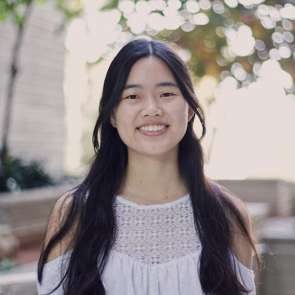

# whoami
### A Picture of Me :O


### Introduction
My name is Jessica Lam and I am currently a 2nd year **Computer Science** student at UC San Diego. I am passionate about **cybersecurity** and also have an interest in anything **cloud** and/or **infrastructure** related. I also love cats, matcha, and basically *all* of the Studio Ghibli movies!

### And a Favorite Quote from a Favorite Book
> We cannot change the cards we are dealt, just how we play the hand.

-Randy Pausch, in *The Last Lecture*

### And Some Random Code?
```
while alive == True:
    keep_moving_forward()
```
You're a legend if you've seen/remember *Meet the Robinsons* :'))

---

# tree
### Table of Contents
- [whoami](https://jesslam948.github.io/#whoami)
- [traceroute journey.me](https://jesslam948.github.io/#traceroute-journeyme)
    - [Beginnings](https://jesslam948.github.io/#my-beginnings)
    - [Experience](https://jesslam948.github.io/#experience)
        - [Research](https://jesslam948.github.io/#research)
        - [Internship](https://jesslam948.github.io/#internship)
        - [Tutoring](https://jesslam948.github.io/#tutoring)
- [ls ./BoxOfFun/](https://jesslam948.github.io/#ls-boxoffun)
    - [Fun Facts](https://jesslam948.github.io/#fun-facts)
    - [Bucket List](https://jesslam948.github.io/#bucket-list)

### Some Relative Links???
- [README.md](./README.md)
- [My Profile Pic](./Jessica_Lam.jpeg)

---

# traceroute journey.me
### My Beginnings
I've always loved puzzles, the challenge and process of problem solving. So, when I started learning how to code, I knew that this was something I wanted to do for as long as possible.

Later in high school, I got my first sneak peek in the world of cybersecurity when I participated in CyberPatriot, a cybersecurity competition run by the AFA. There was such a high learning curve and I struggled, a lot, but the challenge enticed me.

So, here I am, pursuing a degree in Computer Science at UCSD and aspiring to combine my passion for computer science and cybersecurity in my future career!

### Experience
#### Research
**Security Education Research**: I have been involved in research with Professor Adalbert Gerald Soosai Raj since my 1st year of university! We are researching the quality of security education in undergraduate computer science curriculum. Currently, we are examining introductory computer systems courses since these are mid-level courses we believe are most suitable for introducing students to security concepts such as *buffer overflow*
- Published in ACM ICER 2020: [link](https://dl.acm.org/doi/10.1145/3372782.3406266)
- Publishing in ACM SIGSCE TS 2021: link to be updated...

**ERSP - Side Channel Attacks Research**: As a part of the Early Research Scholars Program at UCSD, I am learning how to conduct security research. My group is specifically focusing on a type of security attack technique called side channel attacks and are working this quarter to create a tool that can detect whether or not a victim program is susceptible to a specific type of side channel attack.

#### Internship
**Summer 2020**: I interned under the High Performance Computing division at Los Alamos National Laboratory (LANL). I specifically studied a remote storage access protocol and learned a lot about storage and file systems!

**Summer 2021**: I will be an Information Security Intern at Apple this coming summer! Very excited!

#### Tutoring
I tutor under the Computer Science Engineering Department during the school year. Here's a list of classes (in reverse chrono):

**Winter 2021**: CSE 291/190 - Intro to Computing Education Research

**Fall 2020**: CSE 8A - Intro to Computer Science: Python

**Spring 2020**: CSE 8B - Intro to Computer Science: Java II

---

# ls ./BoxOfFun/
### Fun Facts
1. I've spent hours upon hours upon hours playing Animal Crossing and Stardew Valley
    - I started with Wild World, then played New Leaf, and am now playing New Horizons! I've probably logged wayyyy too many hours on these 3 games alone
    - I was also introduced to SV this past year and am already on Summer Year 2 of my farm! I switch between playing casually and going hard-core haha
2. I love love love art
    - I especially love works created by modern artists like Yayoi Kusama, Takashi Murakami, and Olafur Eliasson
    - I once spent 4 hours walking around the Louvre by myself!... And somehow still managed to not see everything :(
3. I participated in marching band for all 4 years of high school
    - I was in percussion (drums and mallet instruments) and especially enjoyed playing an instrument called the marimba
    - I also learned and performed a different marimba solo each year of high school (~~maybe a video or two are still floating out there...~~)

### Bucket List
- [ ]  Study Abroad (Taiwan? London? Australia? Who knows :D)
- [ ]  Attend DefCon (and all the other super cool hack-y conferences!)
- [ ]  5 Star my Animal Crossing: New Horizons island :O
